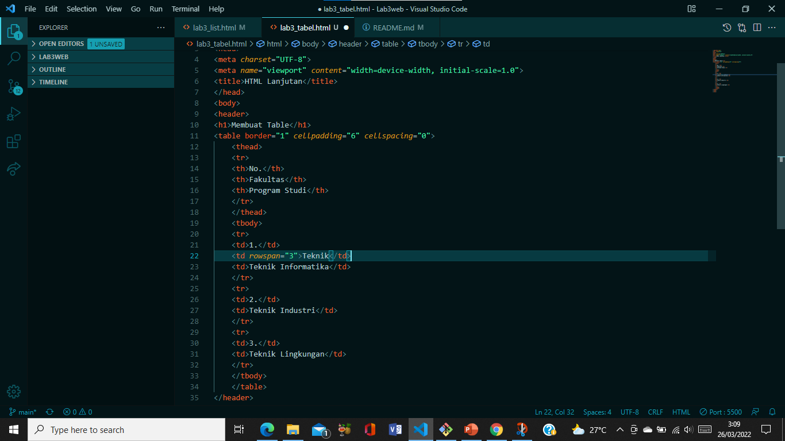

# Tugas Praktikum Lab3Web

| Nova Tegar Adiyansyah | 312010145 |
| --------------- | ----------------|
| TI.20.A1  | Pemrograman Web       |

# Langkah-langkah Praktikum 

## Persiapan membuat dokumen HTML dengan nama file lab3_list.html seperti berikut. 

 

## 1. Membuat Ordered List 

Kemudian tambahkan kode untuk membuat Ordered List seperti berikut. 

 

Maka hasilnya akan seperti ini 

 

## 2. Membuat Unorderd List 
Kemudian tambakan kode untuk membuat Unordered List, setelah deklarasi ordered list pada
section unordered-list, seperti berikut.

 

Refresh pada browsur untuk melihat hasilnya 

 

## 3. Membuat Description List 
Kemudian tambahkan kode untuk membuat description list setelah deklarasi unorderd-list.

 

Simpan dan refresh browsur untuk melihat hasilnya 

 

## 4. Membuat Tabel 
Buat file baru dengan nama lab3_tabel.html seperti berikut.

 

Kemudian selanjutnya tambahkan kode untuk membuat tabel sederhana seperti berikut:

 

Hasilnya akan seperti berikut 

 

## 5. Mengatur Margin dan Padding  
Untuk mengatur margin dan padding pada cel data, tambahkan atribut cellpadding dan
cellspacing pada tag table.
< table border="1" cellpadding="4" cellspacing="0" >

 

## 6. Menggabungkan Sel Data 
Untuk menggabungkan sel data, gunakan atribut rowspan dan colspan. Atribut rowspan untuk
menggabungkan baris (secara vertikal) dan colspan untuk menggabungkan kolom (secara
horizontal).

 

Maka akan seperti berikut 

 
